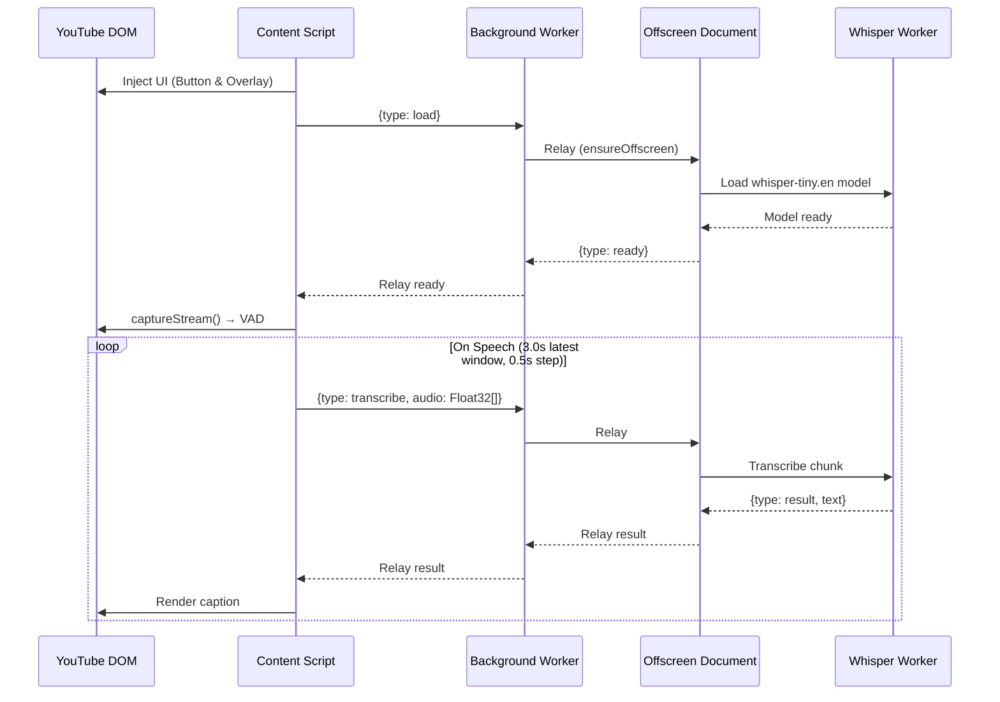
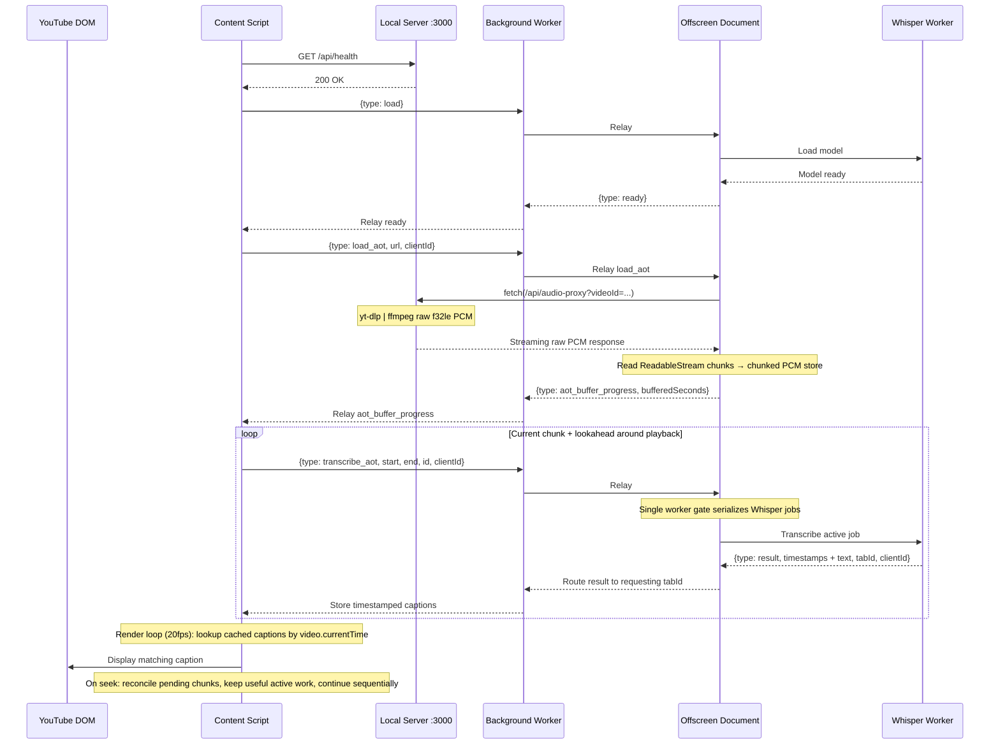

# Mute.ly

Free, private YouTube captions powered by local AI — runs entirely on your machine. No API keys, no cloud servers, and your data never leaves your network.

## What It Does

Mute.ly is a Chrome extension that transcribes YouTube audio using a Whisper model running locally. It supports both live streams and pre-recorded VODs (Video on Demand) using a dual-mode architecture.

- **Fully Local**: All AI inference happens directly in your browser. The VOD backend runs entirely on your local machine.
- **Zero Setup APIs**: No accounts or API keys required.
- **Dual-Mode Processing**:
  - **Live Streams**: Uses real-time Voice Activity Detection (VAD) driven sliding window transcription for low-latency captions directly via browser tab audio capture.
  - **VODs**: Uses a high-performance, seek-aware Ahead-of-Time (AOT) transcription pipeline. A local Node server securely downloads the audio track via `yt-dlp` and proxies it to the extension for offline decoding and fast chunked processing.
- **WASM Optimized**: Runs securely within a single-threaded WebAssembly environment to comply with strict Chrome Manifest V3 Content Security Policies.

## Architecture & Event Flow

The system is split into the **Chrome Extension** (UI + AI inference) and a **Local Node.js Proxy Server** (VOD audio extraction). All communication between the Content Script and the Offscreen Document is relayed through the Background Service Worker — Chrome MV3 does not allow direct messaging between them.

### Live Stream Pipeline

In live mode, the Content Script captures tab audio via `captureStream()`, runs Voice Activity Detection locally (Silero VAD v5), and sends the latest 3.0-second speech window to the Offscreen Document for transcription.



### VOD Pipeline (Streaming Ahead-of-Time)

In VOD mode, audio is processed ahead of playback. The Content Script sends only the proxy **URL** — the Offscreen Document performs the actual HTTP fetch from the local server and progressively reads raw PCM chunks into memory. Captions are rendered on a decoupled 20fps timer using binary search against stored timestamps, enabling instant seek.



#### VOD Queue Contract
The VOD chunking architecture is intentionally simple and deterministic:

- **One AOT Queue Owner**: `AotPipeline` is the only component that decides which VOD chunks to process. It enqueues the current playback chunk plus a small lookahead window.
- **Seek Handling**: Seeking reconciles the pending queue against the new playback window. Useful active work is not aborted, and unchanged nearby queues are preserved.
- **Sequential Processing**: Only one AOT chunk request is active from the content script at a time. `OffscreenClient` rejects accidental overlapping AOT requests instead of overriding an in-flight promise.
- **Worker Gate Only**: The Offscreen Document owns the physical Whisper worker and serializes jobs, but it does not reprioritize AOT chunks. Scheduling stays in `AotPipeline`.
- **Deterministic Cache Reuse**: Completed chunks are cached by stable chunk index. Seeking backward into cached regions restores captions immediately without retranscription.
- **Timing Stability**: Timestamped Whisper output is clamped to the chunk ownership window, adjacent duplicate captions are merged, and a small display grace reduces seam flicker at chunk boundaries.

#### Production Resilience
- **No Seek-Time Worker Poisoning**: Normal seeks never send abort messages to the worker. Old active work can finish cleanly and be reused later.
- **Bounded Caption Cache**: A small LRU cache keeps processed chunks reusable while preventing unbounded long-session growth.
- **Chunked PCM Storage**: VOD PCM audio is stored as streamed chunks in the Offscreen Document instead of one repeatedly reallocated giant buffer.
- **Client/Tab Isolation**: Message payloads carry tab and client ownership metadata so old tabs or replaced clients cannot commit captions into the wrong player.
- **Reliable Model Reuse**: The Offscreen Document tracks whether the model is idle, loading, or ready. Already-loaded models are reused immediately, duplicate load requests attach to the active load, and stalled loads restart the Whisper worker instead of leaving the UI in loading forever.
- **Retryable Chunk Failures**: Temporarily unavailable audio ranges and worker transcription failures return `dropped: true`, so the AOT cache only stores successful chunk outcomes. Revisiting a failed/dequeued chunk can request it again cleanly.
- **Dropped Chunk Deferral**: Dropped chunks are not cached and are deferred briefly before retry so the queue avoids tight retry loops. Explicit seeks clear the deferral so returning to an incomplete chunk can retry immediately.
- **Lower-Latency Live Captions**: Live mode uses a shorter latest-window path and keeps only the newest pending live audio window while Whisper is busy, reducing stale live captions without overlapping workers.

### Component Breakdown

1. **Content Script (`src/content.ts`)**: Monitors the YouTube player, injects UI, and orchestrates the pipeline based on the video type (live vs VOD).
2. **Local Express Server (`server/`)**: Bypasses browser CORS limitations by using `yt-dlp` to download and serve the highest quality audio track. Only used for VODs.
3. **Background Service Worker (`src/background.ts`)**: Stateless message relay between Content Script and Offscreen Document. Also manages the Offscreen Document lifecycle.
4. **Offscreen Document (`src/offscreen.ts`)**: A hidden DOM environment that fetches VOD audio into a chunked PCM store, slices requested ranges, and forwards audio chunks to the Whisper Worker.
5. **Whisper Web Worker (`src/whisper-worker.ts`)**: Runs `Transformers.js` (Whisper-base.en, ONNX q8) in a background thread for non-blocking WASM inference.

## Getting Started

### Prerequisites

- **Google Chrome** 113+ (for WebGPU / modern WASM support)
- **Node.js** 18+ (for building and running the local proxy)
- **yt-dlp**: Must be installed on your system and available in your PATH. 
  - macOS: `brew install yt-dlp`
  - Linux: `sudo apt install yt-dlp`
  - Windows: `winget install yt-dlp`

### Installation

1. Install dependencies and build the extension:
```bash
npm install
npm run build
```

2. Start the local VOD audio proxy server:
```bash
npm run server
```

3. Load the extension in Chrome:
   - Open `chrome://extensions`
   - Enable **Developer mode**
   - Click **Load unpacked** → select the `dist` folder
   - Navigate to any YouTube video and click the speaker icon in the player controls!

On first activation, the model will download (~75MB). A pulsing orange indicator shows progress. After that, it loads from cache instantly.

### Development

For hot-reloading the extension during development:
```bash
npm run dev
```
*(Remember to manually reload the extension in `chrome://extensions` after file changes)*

To clean stale build artifacts before a fresh build:
```bash
npm run clean && npm run build
```

## Project Structure

```
.
├── server/
│   ├── index.cjs               # Express server entry point
│   ├── routes.cjs              # Handles audio proxying and yt-dlp spawning
│   └── temp/                   # Cached .webm audio files (gitignored)
├── src/
│   ├── background.ts           # Service worker: offscreen lifecycle + message routing
│   ├── content.ts              # Content script: YouTube monitor, UI orchestration
│   ├── offscreen.ts            # Offscreen document: AOT audio decoding & slicing
│   ├── whisper-worker.ts       # Web Worker: Transformers.js inference
│   ├── core/
│   │   ├── types.ts            # Shared types: MonitorStatus, message protocol unions
│   │   ├── audio/
│   │   │   ├── audio-extractor.ts    # Live audio capture via VAD + captureStream
│   │   │   └── aot-stream-decoder.ts # VOD PCM stream buffering and slice extraction
│   │   ├── transcription/
│   │   │   ├── transcription-engine.ts  # Orchestrator: routes to JIT or AOT pipeline
│   │   │   ├── offscreen-client.ts      # Chrome messaging client for offscreen document
│   │   │   ├── aot-pipeline.ts          # Seek-aware chunked VOD transcription
│   │   │   └── hallucination-filter.ts  # Filters Whisper phantom outputs
│   │   └── youtube/
│   │       └── youtube-dom.ts           # YouTube DOM queries (video element, controls)
│   └── ui/
│       ├── player-button.ts    # YouTube player button (states: idle/loading/active/error)
│       └── subtitle-overlay.ts # Caption rendering overlay with loading/error states
```

## Technical Details

| Component | Detail |
|---|---|
| **Models** | Live: `onnx-community/whisper-tiny.en`; VOD: `onnx-community/whisper-base.en` (ONNX, quantized q8) |
| **Inference** | Transformers.js v4, single-threaded WASM |
| **Live Audio** | VAD (Silero v5) → 3.0s latest window, 0.5s step |
| **VOD Audio** | AOT decoding via local proxy → seek-aware 30s chunk slicing (25s stride) |
| **Sample Rate** | 16kHz mono Float32 |
| **Permissions** | `offscreen` |

## Testing

Build the extension:

```bash
npm run build
```

---

Built with ❤️ for a more accessible YouTube.
