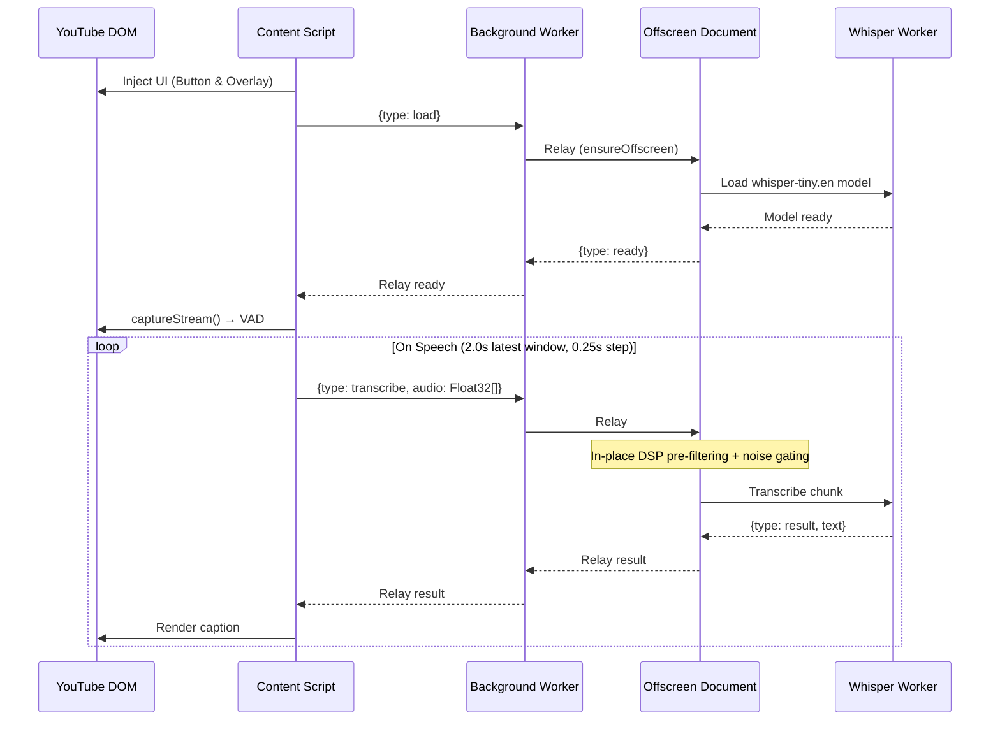
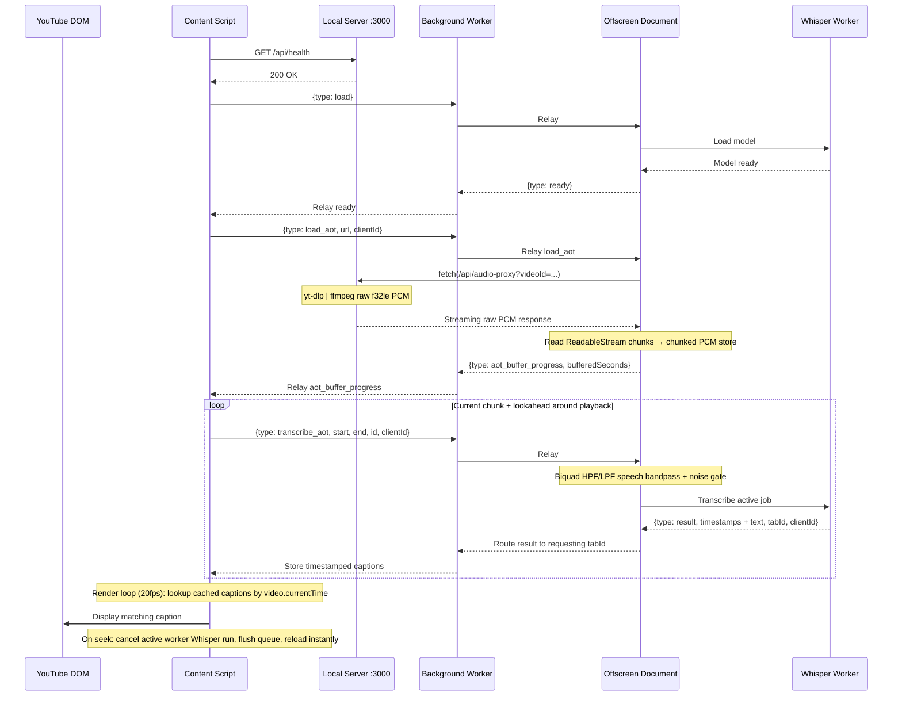

# Mute.ly

<div align="center">

[](https://opensource.org/licenses/MIT)
[](https://chrome.google.com/webstore)
[](http://makeapullrequest.com)
[](https://nodejs.org/)
[](https://webassembly.org/)

**Free, private YouTube captions powered by local AI — running entirely on your machine.**<br>
*No API keys, no cloud servers, and your data never leaves your local network.*

---

[Architecture](#architecture--event-flow) • [DSP Preprocessing](#high-performance-audio-dsp-pipeline) • [Key Features](#key-features) • [Installation](#getting-started) • [Project Structure](#project-structure)

</div>

---

## What It Does

**Mute.ly** is a Chrome extension that transcribes YouTube audio in real-time using a local Whisper model running directly in your browser. It supports both live streams and pre-recorded VODs (Video on Demand) using a specialized dual-mode architecture.

*   **100% Private & Local**: All AI inference happens securely in your browser's WebAssembly environment. The VOD backend runs entirely on your local machine. No tracking, no latency spikes, no cloud subscriptions.
*   **Zero Setup**: No accounts, credit cards, or API keys required. Install and go.
*   **Dual-Mode Processing**:
    *   **Live Streams (JIT)**: Tab audio is captured and analyzed using a low-latency Voice Activity Detection (VAD) driven sliding window loop.
    *   **VODs (AOT)**: A seek-aware Ahead-of-Time pipeline fetches raw PCM audio via a local Node.js proxy server, decode-slices it on-the-fly, and renders captions asynchronously.

---

## Key Features

### 🎙️ Low-Latency Audio DSP Preprocessing
Whisper models can hallucinate or degrade in accuracy when exposed to low-frequency AC rumble, background hum, high-frequency static hiss, or ambient music. Mute.ly solves this by feeding all audio through an in-place Digital Signal Processing (DSP) preprocessor:
*   **Second-Order Butterworth High-Pass Biquad (150Hz)**: Filters out sub-bass rumble and room hum with a steep 12dB/octave slope.
*   **Second-Order Butterworth Low-Pass Biquad (3500Hz)**: Implements telephony-grade bandpass standards (G.711) to isolate human vocal cords and aggressively strip out music, static hiss, and high-frequency noise.
*   **Peak Gain Normalization**: Dynamically scales quiet speakers to peak `0.8` gain while clamping loud sounds, ensuring Whisper always operates in its optimal dynamic range. Safe scaling is bypassed on pure noise to prevent noise amplification.
*   **Steep 20ms Frame Noise Gate**: Smoothly silences pop sounds, breathing, keyboard clicks, and environmental music under `-36dBFS` (RMS `0.015`), completely curing noise-induced hallucinations.

### ⏱️ Temporal Precision & Visual Readability
*   **Constant Latency Offsets**: Compensates for Whisper's temporal attention window by shifting subtitle onset (`+120ms` start) and offset (`+80ms` end) frame-accurately with spoken words.
*   **Bidirectional Overlap Resolution**: Enforces a professional **`80ms` (2 frames) gap** between consecutive subtitles. If adjacent subtitles overlap, the algorithm dynamically trims or shifts boundaries to preserve readability duration and eliminate caption flashing.
*   **Multi-Anchor sliding window merging**: Prevents JIT live subtitles from rewriting dynamically using backward-sliding word overlap alignment.

### 🔌 Production-Grade Extension Engineering
*   **Instant Cooperative Seek Aborts**: Seeking cancels the active Whisper inference run via worker thread abort messages, immediately releasing the queue lock and allowing instant subtitle loading on seek locations.
*   **Manifest V3 Silent Keep-Alive**: Plays a sub-audible 1Hz silent oscillator using the Web Audio API to prevent Google Chrome from ever silently shutting down or suspending the offscreen page worker.
*   **Client/Tab Isolation**: Message payloads carry strict tab and client ID metadata, preventing old or dead browser tabs from corrupting active subtitle players.

---

## Architecture & Event Flow

The system is split into the **Chrome Extension** (UI + WebAssembly AI inference) and a **Local Node.js Proxy Server** (VOD audio extraction). Communication between the Content Script and the Offscreen Document is relayed through the Background Service Worker — Chrome MV3 does not allow direct messaging between them.

```
[YouTube Tab] <== (Service Worker Relay) ==> [Offscreen Page] <==> [Whisper Worker (WASM)]
     ||                                             ||
     || (Live: captureStream)                       || (VOD: HTTP Streaming Fetch)
     \/                                             \/
[Local Audio Output]                        [Local Node Server :3000]
                                                    || (yt-dlp | ffmpeg)
                                                    \/
                                            [YouTube CDN Stream]
```

### Live Stream Pipeline

In live mode, the Content Script captures tab audio via `captureStream()`, runs Voice Activity Detection locally (Silero VAD v5), and sends the latest 2.0-second speech window to the Offscreen Document for transcription.



### VOD Pipeline (Streaming Ahead-of-Time)

In VOD mode, audio is processed ahead of playback. The Content Script sends only the proxy **URL** — the Offscreen Document performs the actual HTTP fetch from the local server and progressively reads raw PCM chunks into memory. Captions are rendered on a decoupled 20fps timer using binary search against stored timestamps, enabling instant seek.



---

## High-Performance Audio DSP Pipeline

Mute.ly features a dedicated **telephony-grade bandpass and silence gating preprocessor** before any audio is sent for AI inference:

```
[Raw Audio PCM] 
      ||
      \/
[Biquad HPF (150Hz)] ===> Cuts hum, AC rumble, sub-bass
      ||
      \/
[Biquad LPF (3500Hz)] ===> Cuts static hiss, high-frequency music
      ||
      \/
[Peak gain Normalizer] ===> Targets 0.8 gain cleanly (bypasses noise)
      ||
      \/
[20ms Noise Gate] ===> Fades signals < -36dBFS to absolute silence
      ||
      \/
[Filtered PCM Speech] ===> Fed to Whisper / VAD
```

---

## Getting Started

### Prerequisites

*   **Google Chrome** 113+ (for WebGPU and modern WebAssembly features)
*   **Node.js** 18+ (for building and serving the local proxy)
*   **yt-dlp**: Must be installed and available in your system path:
    *   macOS: `brew install yt-dlp`
    *   Linux: `sudo apt install yt-dlp`
    *   Windows: `winget install yt-dlp`

### Installation

1.  **Install dependencies and build the extension:**
    ```bash
    npm install
    npm run build
    ```

2.  **Start the local VOD audio proxy server:**
    ```bash
    npm run server
    ```

3.  **Load the extension in Chrome:**
    *   Open `chrome://extensions` in your browser.
    *   Enable **Developer mode** (toggle in the top-right).
    *   Click **Load unpacked** (top-left) and select the `dist` folder generated inside the workspace.
    *   Navigate to any YouTube video and click the speaker icon in the video controls overlay to start captions!

*On first execution, the model will download (~75MB). A pulsing orange indicator shows loading progress. Once downloaded, it is cached locally in IndexedDB for instant startup.*

### Developer Commands

Hot-reload extension changes during development:
```bash
npm run dev
```
Clean the build folder:
```bash
npm run clean
```

---

## Project Structure

```
.
├── server/
│   ├── index.cjs               # Express server entry point
│   ├── routes.cjs              # Spawns yt-dlp & ffmpeg to stream f32le PCM
│   └── temp/                   # Cached webm audio tracks (gitignored)
├── src/
│   ├── background.ts           # Service worker: offscreen lifecycle + relay routing
│   ├── content.ts              # Content script: monitors player and overlays UI
│   ├── offscreen.ts            # Hidden DOM: fetches VOD stream and slices audio
│   ├── whisper-worker.ts       # Web Worker: non-blocking WASM inference
│   ├── core/
│   │   ├── types.ts            # Shared types and message schema unions
│   │   ├── audio/
│   │   │   ├── audio-extractor.ts    # JIT live capturer utilizing Silero VAD
│   │   │   ├── audio-preprocessor.ts # DSP pipeline: HPF/LPF, normalizer, noise gate
│   │   │   └── aot-stream-decoder.ts # Progressive AOT stream PCM store and decoders
│   │   ├── transcription/
│   │   │   ├── transcription-engine.ts  # Logic orchestrator (Live vs VOD)
│   │   │   ├── offscreen-client.ts      # Browser messaging wrapper for offscreen
│   │   │   ├── aot-pipeline.ts          # Seek-aware chunked AOT scheduler
│   │   │   └── hallucination-filter.ts  # Filters Whisper phantom text patterns
│   │   └── youtube/
│   │       └── youtube-dom.ts           # DOM scraping and player controls
│   └── ui/
│       ├── player-button.ts    # Custom control bar button (loading/ready states)
│       ├── subtitle-overlay.ts # Premium typography caption visual overlays
│       └── overlay-styles.ts   # Curated dark mode glassmorphic layout CSS
```

---

## Technical Specifications

| Parameter | Specification |
|:---|:---|
| **WASM Models** | Live: `whisper-tiny.en` (~75MB) • VOD: `whisper-base.en` (~140MB) |
| **Quantization** | ONNX quantized q8 (8-bit integer weights) for optimal CPU cache hits |
| **Speech Bandpass** | Second-order Butterworth Biquad (`150Hz - 3500Hz`) |
| **Noise Gate** | 20ms Frame RMS at `0.015` threshold (-36dBFS) |
| **Gain Target** | Normalization peak target of `0.8` (triggered above `0.06` peak) |
| **Format** | 16kHz mono Float32 Linear PCM |
| **CPU Threading** | Multi-threaded WASM inference (`numThreads` dynamic based on hardware core concurrency) |

---

## License

This project is open-source and available under the [MIT License](LICENSE).

*Built with ❤️ for a more private, accessible, and fast YouTube viewing experience.*
