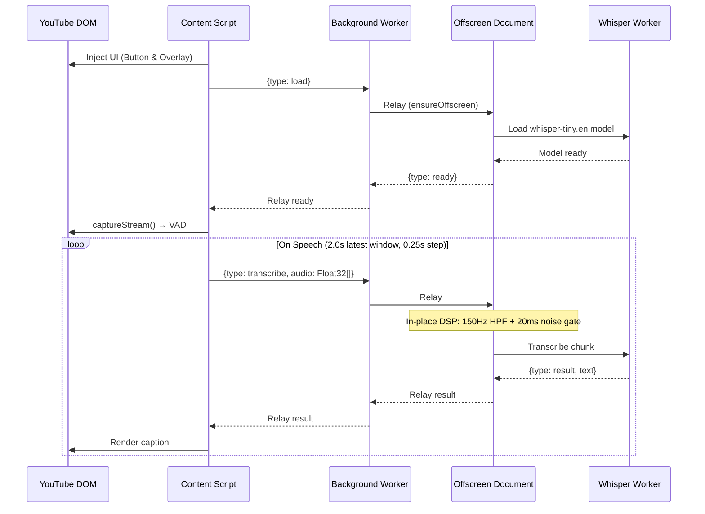
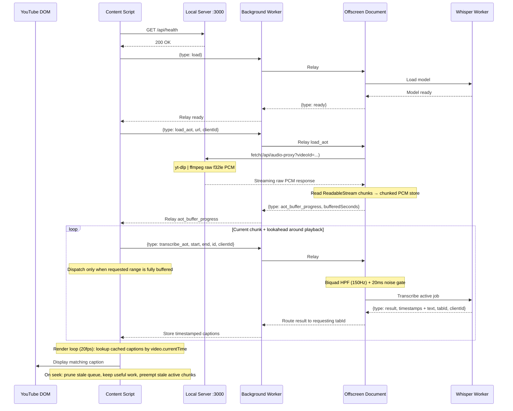

<div align="center">
   
# Mute.ly


<br/>
<br/>

[](https://opensource.org/licenses/MIT)
[](https://chrome.google.com/webstore)
[](http://makeapullrequest.com)
[](https://nodejs.org/)
[](https://webassembly.org/)

**Free, private YouTube captions powered by local AI — running entirely on your machine.**<br>
*No API keys, no cloud servers, and your data never leaves your local network.*

---

[Architecture](#architecture--event-flow) • [DSP Preprocessing](#high-performance-audio-dsp-pipeline) • [Key Features](#key-features) • [Installation](#getting-started) • [Project Structure](#project-structure)

</div>

---

## What It Does

**Mute.ly** is a Chrome extension that transcribes YouTube audio in real-time using a local Whisper model running directly in your browser. It supports both live streams and pre-recorded VODs (Video on Demand) using a specialized dual-mode architecture.

*   **100% Private & Local**: All AI inference happens securely in your browser's WebAssembly environment. The VOD backend runs entirely on your local machine. No tracking, no latency spikes, no cloud subscriptions.
*   **Zero Setup**: No accounts, credit cards, or API keys required. Install and go.
*   **Dual-Mode Processing**:
    *   **Live Streams (JIT)**: Tab audio is captured and analyzed using a low-latency Voice Activity Detection (VAD) driven sliding window loop.
    *   **VODs (AOT)**: A seek-aware Ahead-of-Time pipeline fetches raw PCM audio through a Chrome **native messaging host** (auto-spawned by the browser on demand — no terminal required after a one-time install), keeps a progressive in-memory PCM buffer, slices buffered ranges on demand, and renders timestamped captions asynchronously.

---

## Key Features

### 🎙️ Low-Latency Audio DSP Preprocessing
Whisper-class models hallucinate on low-frequency AC rumble and ambient room hum. Mute.ly feeds all audio through an in-place DSP preprocessor tuned for modern full-band ASR:
*   **Second-Order Butterworth High-Pass Biquad (150Hz)**: Filters out sub-bass rumble and room hum with a steep 12dB/octave slope.
*   **20ms Frame Noise Gate (-36dBFS)**: Frame-by-frame RMS gate at `0.015` silences breathing, keyboard clicks, and ambient noise under threshold — curing noise-induced hallucinations without touching dynamic range.
*   **No lowpass, no normalizer**: Newer ONNX Whisper variants (and distil/moonshine) tolerate full-band 16kHz audio cleanly; the older 3500Hz LPF + peak-norm helped Whisper-tiny but hurt newer checkpoints, so both were removed. See `src/core/audio/audio-preprocessor.ts`.

### ⏱️ Temporal Precision & Visual Readability
*   **Constant Latency Offsets**: Compensates for Whisper's temporal attention window by shifting subtitle onset (`+120ms` start) and offset (`+80ms` end) frame-accurately with spoken words.
*   **Bidirectional Overlap Resolution**: Enforces a professional **`80ms` (2 frames) gap** between consecutive subtitles. If adjacent subtitles overlap, the algorithm dynamically trims or shifts boundaries to preserve readability duration and eliminate caption flashing.
*   **Multi-Anchor sliding window merging**: Prevents JIT live subtitles from rewriting dynamically using backward-sliding word overlap alignment.

### 🔌 Production-Grade Extension Engineering
*   **Seek-Aware AOT Scheduling**: Seeking prunes stale pending work, keeps useful in-flight chunks when they still cover the new playhead, and preempts stale Whisper jobs when the active chunk no longer matches the target region.
*   **Worker Recovery for Stale VOD Jobs**: AOT aborts can restart the Whisper worker while preserving queued work, preventing old inference jobs from blocking captions after rapid seeking.
*   **Buffered-Range Guards**: VOD chunk dispatch waits until the full requested audio slice is available, avoiding partial or misleading captions when seeking beyond the current PCM buffer frontier.
*   **Manifest V3 Silent Keep-Alive**: Plays a sub-audible 1Hz silent oscillator using the Web Audio API to prevent Google Chrome from ever silently shutting down or suspending the offscreen page worker.
*   **Client/Tab Isolation**: Message payloads carry strict tab and client ID metadata, preventing old or dead browser tabs from corrupting active subtitle players.

---

## Architecture & Event Flow

The system is split into the **Chrome Extension** (UI + WebAssembly AI inference) and a **Chrome Native Messaging Host** (VOD audio extraction, auto-spawned by Chrome on demand). Communication between the Content Script and the Offscreen Document is relayed through the Background Service Worker — Chrome MV3 does not allow direct messaging between them.

```
[YouTube Tab] <== (Service Worker Relay) ==> [Offscreen Page] <==> [ASR Worker (WebGPU/WASM)]
     ||                                             ||
     || (Live: captureStream)                       || (VOD: connectNative stdio port)
     \/                                             \/
[Local Audio Output]                        [Native Host: mutely-host.cjs]
                                                    || (yt-dlp | ffmpeg, base64 PCM frames)
                                                    \/
                                            [YouTube CDN Stream]
```

### Live Stream Pipeline

In live mode, the Content Script captures tab audio via `captureStream()`, runs Voice Activity Detection locally (Silero VAD v5), and sends the latest 2.0-second speech window to the Offscreen Document for transcription.



### VOD Pipeline (Streaming Ahead-of-Time)

In VOD mode, audio is processed ahead of playback. The Content Script sends only the proxy **URL** — the Offscreen Document performs the actual HTTP fetch from the local server and progressively reads raw PCM chunks into memory. Captions are rendered on a decoupled 20fps timer using binary search against stored timestamps. The scheduler follows the current playhead and lookahead window, waits for buffered audio before dispatching a chunk, and avoids re-requesting completed ranges.



### VOD Seeking Behavior

VOD transcription is scheduled around the current YouTube playhead using 30-second chunks with a 25-second stride. Each chunk is keyed by its canonical time range, so already-completed ranges are not requested again after backward seeks or scrubbing.

When the user seeks:
*   Pending chunks outside the new playhead window are discarded.
*   Pending chunks that are still useful are retained instead of requeued.
*   The active chunk is kept only if it covers the new playhead.
*   If the active chunk is stale, the content-side request is resolved as aborted and the offscreen worker is restarted so stale Whisper inference cannot block the next requested chunk.
*   If the target range is not yet buffered, dispatch waits until buffer progress reaches the requested chunk end.

---

## High-Performance Audio DSP Pipeline

Mute.ly runs a minimal **highpass + noise-gate preprocessor** before any audio is sent for AI inference. The pipeline was previously a telephony bandpass with peak normalization; modern ONNX Whisper variants don't need it, so the LPF and gain stages were removed:

```
[Raw Audio PCM]
      ||
      \/
[Biquad HPF (150Hz)] ===> Cuts hum, AC rumble, sub-bass
      ||
      \/
[20ms Noise Gate] ===> Fades signals < -36dBFS to absolute silence
      ||
      \/
[Filtered PCM Speech] ===> Fed to Whisper / VAD
```

---

## Getting Started

### Prerequisites

*   **Google Chrome** 113+ (for WebGPU and modern WebAssembly features)
*   **Node.js** 18+ (for building and serving the local proxy)
*   **yt-dlp**: Must be installed and available in your system path:
    *   macOS: `brew install yt-dlp`
    *   Linux: `sudo apt install yt-dlp`
    *   Windows: `winget install yt-dlp`

### Installation

1.  **Install dependencies and build the extension:**
    ```bash
    npm install
    npm run build
    ```

2.  **Load the extension in Chrome (one time):**
    *   Open `chrome://extensions` in your browser.
    *   Enable **Developer mode** (toggle in the top-right).
    *   Click **Load unpacked** (top-left) and select the `dist` folder.
    *   Copy the extension ID shown on the extension card.

3.  **Install the native messaging host (one time):**
    ```bash
    npm run install-host -- --extension-id=<YOUR_EXTENSION_ID>
    ```
    This writes a `com.mutely.host.json` manifest into Chrome's native-messaging directory for your OS (Chrome, Brave, Edge on macOS; Chrome, Chromium, Brave on Linux; Chrome on Windows). It also checks that `yt-dlp` and `ffmpeg` are on your PATH and refuses to register if either is missing.

4.  **Use it:** open any YouTube video, click the speaker icon in the player controls. Chrome auto-launches the host process per session — no terminal, no `npm run server`, ever.

*On first execution, the model will download (~75MB). A pulsing orange indicator shows loading progress. Once downloaded, it is cached locally in IndexedDB for instant startup.*

## Project Structure

```
.
├── public/
│   ├── manifest.json            # MV3 manifest
│   └── capture-worklet.js       # AudioWorklet for live raw-PCM capture off the main thread
├── host/
│   ├── mutely-host.cjs          # Native messaging host: spawns yt-dlp | ffmpeg, streams base64 PCM over stdio
│   ├── install.cjs              # One-time installer; writes Chrome native-messaging manifest, checks PATH
│   ├── uninstall.cjs            # Removes the manifest from all supported browser dirs
│   └── manifest/com.mutely.host.json  # Template patched at install time
├── src/
│   ├── background.ts            # Service worker: offscreen lifecycle + message relay
│   ├── content.ts               # Content script: YouTube monitor, UI overlay, mode select
│   ├── offscreen.ts             # Hidden DOM: worker queue, AOT decoder, keep-alive oscillator
│   ├── asr-worker.ts            # Web Worker: ONNX Whisper inference (WebGPU/WASM)
│   ├── core/
│   │   ├── types.ts                       # OffscreenCommand / OffscreenEvent / WorkerCommand unions
│   │   ├── audio/
│   │   │   ├── live-streamer.ts           # captureStream() + Silero VAD v5 lifecycle (live mode)
│   │   │   ├── audio-preprocessor.ts      # 150Hz HPF biquad + 20ms noise gate
│   │   │   └── aot-stream-decoder.ts      # Progressive AOT PCM store + range slicer + silence check
│   │   ├── transcription/
│   │   │   ├── transcription-engine.ts    # Live vs VOD orchestrator (single facade for content.ts)
│   │   │   ├── offscreen-client.ts        # Cross-context messaging wrapper, per-tab clientId
│   │   │   ├── aot-pipeline.ts            # Render loop + caption cache (LRU 500)
│   │   │   ├── aot-scheduler.ts           # Pure chunk-window math (30s window / 25s stride)
│   │   │   └── hallucination-filter.ts    # Filters Whisper phantom-text patterns
│   │   ├── errors/
│   │   │   └── error-mapper.ts            # Runtime errors → user-facing title/advice
│   │   └── youtube/
│   │       └── youtube-dom.ts             # DOM scraping (video ID, live badge, controls)
│   └── ui/
│       ├── player-button.ts     # Custom control-bar toggle (idle / loading / active)
│       ├── subtitle-overlay.ts  # Caption rendering (committed + tentative, mode-aware transition)
│       ├── error-overlay.ts     # Error modal with title/advice/retry
│       └── overlay-styles.ts    # Shared CSS-in-JS style objects
```

---

## Technical Specifications

| Parameter | Specification |
|:---|:---|
| **ASR Model** | `whisper-tiny.en` (~75MB) for both live and VOD |
| **Inference Backend** | WebGPU when `navigator.gpu` is available, WASM fallback (with auto-retry on late WebGPU init failure) |
| **Quantization** | ONNX quantized q8 (8-bit integer weights) for optimal CPU cache hits |
| **Speech Highpass** | Second-order Butterworth Biquad (`150Hz`, Q ≈ 0.7071) |
| **Noise Gate** | 20ms frame RMS at `0.015` threshold (-36dBFS) |
| **Format** | 16kHz mono Float32 Linear PCM, end-to-end |
| **CPU Threading** | Multi-threaded WASM inference (`numThreads` capped at 4, scales with `navigator.hardwareConcurrency`) |

---

## License

This project is open-source and available under the [MIT License](LICENSE).

*Built with ❤️ for a more private, accessible, and fast YouTube viewing experience.*
